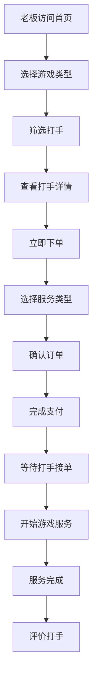

# 装糖电竞 - 打手招募与老板点单平台 PRD

## 1. 产品概述

装糖电竞是一个专业的电竞陪玩服务平台，连接游戏高手（打手）与游戏玩家（老板）。平台提供双端入口：打手端用于招募和管理打手团队，老板端用于浏览服务、下单预约。

- **主要目的**：打造专业、高效的电竞陪玩交易撮合平台
- **目标用户**：游戏高手（打手）、游戏玩家（老板）
- **市场价值**：电竞陪玩市场规模持续增长，专业平台可提升交易效率和用户体验

## 2. 核心功能

### 2.1 用户角色

| 角色 | 注册方式 | 核心权限 |
|------|----------|----------|
| 打手 | 手机号注册 + 资质审核 | 接单、展示个人技能、查看订单、提现 |
| 老板 | 手机号/微信登录 | 浏览打手、下单预约、评价、充值 |
| 管理员 | 后台分配 | 审核打手、管理订单、平台运营 |

### 2.2 功能模块

**打手端（招募版）**
1. **首页**：平台介绍、招募优势展示、成功案例
2. **注册申请**：打手资质提交、游戏段位证明
3. **打手中心**：接单管理、收入统计、评价查看
4. **我的主页**：个人技能展示、服务定价、历史战绩

**老板端（点单版）**
1. **首页**：热门打手推荐、游戏分类、活动Banner
2. **打手列表**：筛选搜索、打手详情、价格对比
3. **下单页面**：选择服务、预约时间、支付确认
4. **订单中心**：订单状态、历史记录、评价系统
5. **个人中心**：账户余额、充值提现、消息通知

### 2.3 页面详情

| 页面名称 | 模块名称 | 功能描述 |
|----------|----------|----------|
| 打手首页 | 英雄区 | 平台Slogan、招募优势、立即加入按钮 |
| 打手首页 | 成功案例 | 优秀打手展示、收入数据 |
| 打手首页 | 招募流程 | 四步流程图：注册→审核→接单→提现 |
| 注册申请 | 基本信息 | 昵称、头像、联系方式、游戏账号 |
| 注册申请 | 技能认证 | 游戏选择、段位证明、擅长位置 |
| 注册申请 | 服务设置 | 服务类型、定价、可用时间 |
| 打手中心 | 订单管理 | 待接单、进行中、已完成订单列表 |
| 打手中心 | 收入统计 | 今日/本周/本月收入图表 |
| 打手中心 | 评价管理 | 老板评价列表、评分统计 |
| 老板首页 | 搜索栏 | 游戏筛选、段位筛选、价格区间 |
| 老板首页 | 推荐打手 | 轮播展示高评分打手 |
| 老板首页 | 分类入口 | 按游戏类型快速进入 |
| 打手列表 | 筛选器 | 游戏、段位、价格、性别筛选 |
| 打手列表 | 打手卡片 | 头像、昵称、段位、价格、评分 |
| 打手详情 | 个人信息 | 头像、昵称、段位、服务次数 |
| 打手详情 | 技能展示 | 擅长英雄、胜率、历史战绩 |
| 打手详情 | 评价列表 | 老板评价内容、评分 |
| 打手详情 | 立即下单 | 选择服务类型、时间、支付 |
| 下单页面 | 服务确认 | 打手信息、服务时长、价格明细 |
| 下单页面 | 支付方式 | 余额支付、微信支付、支付宝 |
| 订单中心 | 订单列表 | 全部/待支付/进行中/已完成 |
| 订单中心 | 订单详情 | 打手信息、服务记录、评价入口 |
| 个人中心 | 账户信息 | 头像、昵称、余额、优惠券 |
| 个人中心 | 充值中心 | 充值金额选择、支付方式 |
| 个人中心 | 消息通知 | 系统通知、订单提醒 |

## 3. 核心流程

### 打手招募流程
1. 打手访问招募页面，点击"立即加入"
2. 填写基本信息和游戏资质
3. 上传段位证明截图
4. 提交审核，等待管理员审批
5. 审核通过后，完善个人主页
6. 开始接单，完成服务获得收入

### 老板点单流程
1. 老板浏览首页，选择游戏类型
2. 筛选打手，查看详情和评价
3. 选择心仪打手，点击"立即下单"
4. 选择服务类型和时长
5. 确认订单信息，完成支付
6. 等待打手接单，开始游戏
7. 服务完成后，评价打手

## 4. 用户界面设计

### 4.1 设计风格

- **主色调**：
  - 打手端：电竞蓝 (#00D9FF) + 深色背景 (#0A0E27)
  - 老板端：活力橙 (#FF6B35) + 白色背景 (#FFFFFF)
- **辅助色**：
  - 成功绿 (#00FF88)
  - 警告黄 (#FFD600)
  - 错误红 (#FF3860)
- **按钮风格**：圆角矩形，带微渐变和悬停发光效果
- **字体**：
  - 标题：思源黑体 Bold，24-32px
  - 正文：思源黑体 Regular，14-16px
  - 数据：DIN Pro，突出数字展示
- **布局风格**：卡片式布局，圆角 12px，阴影柔和
- **图标风格**：线性图标，2px描边，与主题色一致

### 4.2 页面设计概览

| 页面名称 | 模块名称 | UI元素 |
|----------|----------|--------|
| 打手首页 | 英雄区 | 全屏背景视频、大号Slogan、发光按钮、粒子动画 |
| 打手首页 | 成功案例 | 卡片网格、头像光环、收入数字滚动动画 |
| 打手首页 | 招募流程 | 横向时间轴、步骤图标、连接线动画 |
| 注册申请 | 表单 | 浮动标签输入框、实时验证提示、进度指示器 |
| 老板首页 | 搜索栏 | 圆角搜索框、下拉筛选、热门搜索标签 |
| 老板首页 | 推荐打手 | 横向滚动卡片、头像边框光效、评分星星 |
| 打手列表 | 打手卡片 | 头像、段位徽章、价格标签、立即预约按钮 |
| 打手详情 | 技能展示 | 雷达图、胜率进度条、英雄图标网格 |
| 下单页面 | 价格明细 | 明细列表、优惠券选择、总价高亮 |
| 订单中心 | 订单卡片 | 状态标签、打手信息、操作按钮 |

### 4.3 响应式设计

- **桌面优先**：最小宽度 1280px，推荐 1920px
- **平板适配**：768px-1024px，调整卡片网格列数
- **移动端**：375px-767px，单列布局，底部导航栏
- **触摸优化**：按钮最小 44px，间距充足，滑动流畅

### 4.4 3D场景指导（打手首页英雄区）

- **环境/HDRI**：深色电竞氛围，蓝色霓虹光效
- **灯光设置**：
  - 主光源：顶部蓝色聚光灯
  - 辅助光：侧面紫色边缘光
  - 环境光：低强度冷色调
- **相机设置**：
  - 初始位置：正前方微俯视
  - 运动：缓慢环绕，展示深度
- **构图与焦点**：
  - 中心：平台Logo或Slogan
  - 前景：漂浮的游戏元素（键盘、鼠标、耳机）
  - 背景：粒子光效、网格地面
- **交互与动画**：
  - 鼠标移动：视差效果
  - 悬停：元素发光增强
  - 点击：粒子爆发效果
- **后处理效果**：
  - 泛光（Bloom）：增强光效
  - 景深（DOF）：突出焦点
  - 色彩分级：冷色调统一

## 5. 技术约束

- 纯前端实现，数据使用 Mock
- 支持现代浏览器（Chrome、Firefox、Safari、Edge）
- 页面加载时间 < 3秒
- 支持键盘导航和无障碍访问
