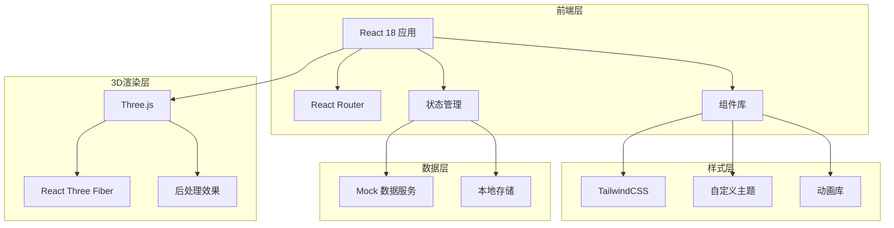
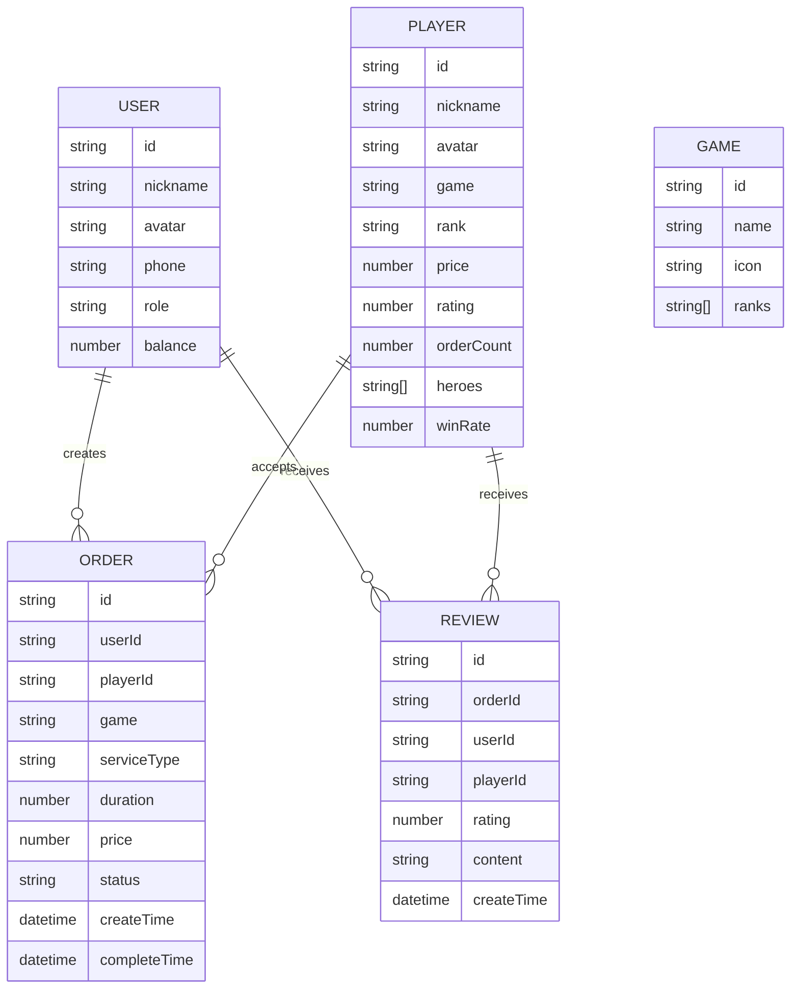

# 装糖电竞 - 技术架构文档

## 1. 架构设计



## 2. 技术说明

- **前端框架**: React 18 + TypeScript
- **构建工具**: Vite
- **样式方案**: TailwindCSS 3
- **路由管理**: React Router DOM v6
- **状态管理**: Zustand（轻量级状态管理）
- **3D渲染**: 
  - Three.js
  - @react-three/fiber
  - @react-three/drei
  - @react-three/postprocessing
- **动画库**: Framer Motion（页面过渡和微交互）
- **图标库**: Lucide React
- **图表库**: Recharts（收入统计图表）
- **数据模拟**: Mock.js（生成模拟数据）
- **本地存储**: localStorage（用户会话和偏好）

## 3. 路由定义

| 路由 | 页面名称 | 说明 |
|------|----------|------|
| / | 首页 | 平台入口，双端选择 |
| /recruit | 打手招募首页 | 打手端首页，展示招募信息 |
| /recruit/apply | 打手注册申请 | 打手资质提交表单 |
| /recruit/center | 打手中心 | 打手订单管理和收入统计 |
| /recruit/profile | 打手主页 | 打手个人技能展示 |
| /order | 老板点单首页 | 老板端首页，打手推荐 |
| /order/list | 打手列表 | 打手筛选和搜索 |
| /order/detail/:id | 打手详情 | 打手详细信息和评价 |
| /order/booking/:id | 下单页面 | 服务选择和支付确认 |
| /order/history | 订单中心 | 历史订单列表 |
| /user/center | 个人中心 | 用户账户管理 |
| /user/recharge | 充值中心 | 账户充值 |

## 4. 数据模型

### 4.1 数据模型定义



### 4.2 数据类型定义

```typescript
// 用户类型
interface User {
  id: string;
  nickname: string;
  avatar: string;
  phone: string;
  role: 'boss' | 'player';
  balance: number;
  coupons?: Coupon[];
}

// 打手类型
interface Player {
  id: string;
  nickname: string;
  avatar: string;
  game: string;
  rank: string;
  price: number;
  rating: number;
  orderCount: number;
  heroes: string[];
  winRate: number;
  description: string;
  availableTime: string[];
  reviews: Review[];
}

// 订单类型
interface Order {
  id: string;
  userId: string;
  playerId: string;
  player: Player;
  game: string;
  serviceType: '陪玩' | '上分' | '教学';
  duration: number; // 小时
  price: number;
  status: 'pending' | 'paid' | 'ongoing' | 'completed' | 'cancelled';
  createTime: string;
  completeTime?: string;
  review?: Review;
}

// 评价类型
interface Review {
  id: string;
  orderId: string;
  userId: string;
  playerId: string;
  rating: number; // 1-5
  content: string;
  createTime: string;
}

// 游戏类型
interface Game {
  id: string;
  name: string;
  icon: string;
  ranks: string[];
}

// 优惠券类型
interface Coupon {
  id: string;
  name: string;
  discount: number;
  minAmount: number;
  expireTime: string;
}
```

## 5. 组件架构

```
src/
├── components/
│   ├── common/
│   │   ├── Button.tsx          # 通用按钮组件
│   │   ├── Card.tsx            # 卡片容器
│   │   ├── Input.tsx           # 输入框
│   │   ├── Modal.tsx           # 模态框
│   │   └── Rating.tsx          # 评分星星
│   ├── layout/
│   │   ├── Header.tsx          # 顶部导航
│   │   ├── Footer.tsx          # 底部信息
│   │   └── Sidebar.tsx         # 侧边栏
│   ├── recruit/
│   │   ├── HeroSection.tsx     # 打手首页英雄区
│   │   ├── SuccessCases.tsx    # 成功案例展示
│   │   ├── RecruitProcess.tsx  # 招募流程图
│   │   └── ApplicationForm.tsx # 申请表单
│   ├── order/
│   │   ├── PlayerCard.tsx      # 打手卡片
│   │   ├── PlayerList.tsx      # 打手列表
│   │   ├── FilterBar.tsx       # 筛选栏
│   │   └── BookingForm.tsx     # 下单表单
│   └── dashboard/
│       ├── OrderManagement.tsx # 订单管理
│       ├── IncomeChart.tsx     # 收入图表
│       └── ReviewList.tsx      # 评价列表
├── pages/
│   ├── Home.tsx                # 首页
│   ├── RecruitHome.tsx         # 打手招募首页
│   ├── RecruitApply.tsx        # 打手注册申请
│   ├── RecruitCenter.tsx       # 打手中心
│   ├── OrderHome.tsx           # 老板点单首页
│   ├── OrderList.tsx           # 打手列表
│   ├── PlayerDetail.tsx        # 打手详情
│   ├── Booking.tsx             # 下单页面
│   ├── OrderHistory.tsx        # 订单中心
│   └── UserCenter.tsx          # 个人中心
├── services/
│   ├── mock/
│   │   ├── players.ts          # 打手模拟数据
│   │   ├── orders.ts           # 订单模拟数据
│   │   └── users.ts            # 用户模拟数据
│   └── api.ts                  # API 服务封装
├── store/
│   ├── userStore.ts            # 用户状态
│   ├── orderStore.ts           # 订单状态
│   └── playerStore.ts          # 打手状态
├── utils/
│   ├── format.ts               # 格式化工具
│   ├── storage.ts              # 本地存储
│   └── validation.ts           # 表单验证
├── styles/
│   └── globals.css             # 全局样式
├── App.tsx
└── main.tsx
```

## 6. 性能优化

- **代码分割**: 使用 React.lazy 和 Suspense 实现路由级代码分割
- **图片优化**: 使用 WebP 格式，懒加载非首屏图片
- **3D优化**: 
  - 使用 LOD（Level of Detail）控制模型复杂度
  - 限制帧率为 60fps
  - 非首屏 3D 场景延迟加载
- **缓存策略**: 使用 React Query 缓存 API 请求
- **Bundle 分析**: 使用 vite-bundle-analyzer 分析包体积

## 7. 部署方案

- **构建输出**: dist 目录
- **静态资源**: CDN 加速
- **部署平台**: GitHub Pages / Vercel / Netlify
- **环境配置**: 
  - 开发环境: .env.development
  - 生产环境: .env.production
